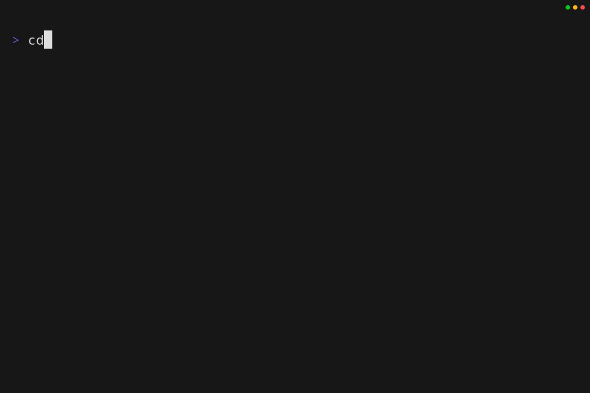

# Circuit Breaker Labs Command-Line Interface

  

  <i>Recorded with <a href="https://github.com/charmbracelet/vhs">vhs</i>💙</a>

## Installation

Pre-built binaries and installation scripts are automatically generated and available with each [release](https://github.com/circuitbreakerlabs/cli/releases).
